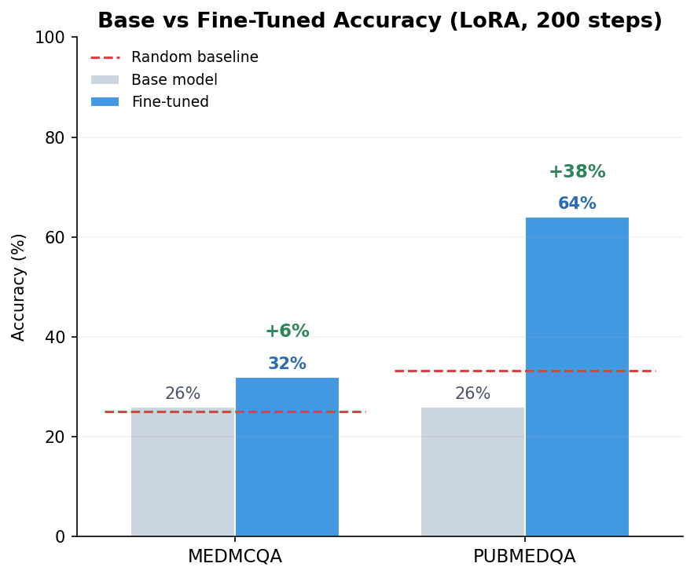

# MedicalQA LLM Fine-Tuning

This project builds a **medical QA quiz** powered by fine-tuned language models.
Questions are drawn from real medical datasets (**PubMedQA**, **MedMCQA**); you
pick an answer, and a **fine-tuned model explains** why the correct answer is
right. Fine-tuning with LoRA measurably improves the model over the base
`unsloth/Llama-3.2-1B` — and the project trains, evaluates, and visualizes that
improvement end to end.

## Results

Fine-tuning lifts both tasks above their base model and random baselines, with
<1% of parameters trained (LoRA, 200 steps, 4-bit QLoRA on GPU):

| Dataset | Random | Base | Fine-tuned | Improvement |
|---------|-------:|-----:|-----------:|------------:|
| PubMedQA | 33.3% | 26% | **64%** | **+38%** |
| MedMCQA | 25% | 26% | **32%** | **+6%** |



Details: [`docs/RESULTS.md`](docs/RESULTS.md) · [`docs/FINETUNING.md`](docs/FINETUNING.md)

## Features

- Load PubMedQA & MedMCQA from Hugging Face and convert to Alpaca instruction format
- Dataset quality checks, statistics, and visual plots
- Auto-detect CUDA / Apple MPS / CPU and pick a safe precision strategy
- Fine-tune with LoRA (MPS) or 4-bit QLoRA (CUDA) via TRL `SFTTrainer`
- Resume interrupted training from checkpoints (`--resume`)
- Base-vs-fine-tuned evaluation with per-question CSVs and a comparison plot
- One-line GPU training on Google Colab
- FastAPI **quiz web app**: dataset questions + AI explanations from the fine-tuned model

## Installation

Uses [`uv`](https://github.com/astral-sh/uv) with Python 3.12:

```bash
uv venv --python 3.12 .venv
uv pip install -r requirements.txt --python .venv/bin/python
source .venv/bin/activate
```

## Workflow

```bash
# 1. Prepare datasets (Alpaca format)
python scripts/prepare_dataset.py

# 2. Inspect hardware + data
python scripts/check_device.py
python scripts/visualize_dataset.py          # plots/ -> answer dist, lengths, subjects

# 3. Fine-tune + compare (base vs fine-tuned). Use a GPU — see note below.
python scripts/run_experiment.py --datasets medmcqa pubmedqa --max-steps 200

# 4. Regenerate the comparison plot from results
python scripts/plot_comparison.py

# 5. Serve the quiz with a fine-tuned adapter
python scripts/serve.py --adapter-path experiments/pubmedqa/final_adapter
```

Then open **http://127.0.0.1:8000** — pick a task, answer a question, and click
**Get AI Explanation** to see the fine-tuned model explain the answer.

## ⚠️ Train on GPU, not Apple MPS

Fine-tuning on Apple MPS **diverges to NaN weights** (fp16 instability — the
model ends up emitting `!!!!!!!` and scores 0%). MPS is fine for the quiz and
base-model evaluation, **but not for training.** Train on a CUDA GPU instead,
where the project auto-uses stable 4-bit QLoRA.

The easy path is **Google Colab's free GPU** — run in one cell
(Runtime → Change runtime type → GPU):

```bash
# both datasets
!curl -sSL https://raw.githubusercontent.com/M9star/medicalQA_llm_finetuning/main/scripts/colab_train.sh | bash
```

See [`docs/FINETUNING.md`](docs/FINETUNING.md) for resuming interrupted runs and
moving adapters back to your machine.

## CLI (after `uv pip install -e .`)

```bash
medicalqa prepare --dataset all
medicalqa analyze --dataset medmcqa
medicalqa visualize
medicalqa check-device
medicalqa train --max-steps 200 --resume
medicalqa evaluate --dataset pubmedqa --adapter-path experiments/pubmedqa/final_adapter
medicalqa serve --adapter-path experiments/medmcqa/final_adapter
```

## Configuration

Defaults live in `src/medicalqa_finetuning/config.py`:
`DatasetConfig` (names, split sizes, seed), `TrainingConfig` (model, LoRA params,
batch/lr/steps, resume), `EvaluationConfig` (dataset, adapter, samples, output CSV).
CLI flags override the common ones.

## What is and isn't in git

Tracked: all source, scripts, docs, and **lightweight results** (eval CSVs,
`RESULTS.json`, `COMPARISON.md`, `comparison.png`).

Gitignored (large / reproducible): model adapter weights
(`experiments/**/final_adapter/`), checkpoints, prepared datasets, `.venv/`,
and downloaded base models. Adapters are reproducible via Colab; back them up
to Google Drive if you want to keep them without retraining (see below).

## Project status — completed

The project was built and finalized through these steps, end to end:

1. **Environment** — Python 3.12 venv with `uv`, all dependencies installed.
2. **Data preparation** — PubMedQA & MedMCQA loaded and converted to Alpaca format.
3. **Analysis & visualization** — answer distributions, question lengths, and subject plots.
4. **Fine-tuning** — LoRA adapters trained on GPU (4-bit QLoRA) for both datasets, with checkpoint resume.
5. **Evaluation** — base vs fine-tuned accuracy measured on held-out questions.
6. **Comparison** — combined results table + bar chart showing the improvement.
7. **Quiz web app** — FastAPI interface serving the fine-tuned models for live Q&A explanations.

**Outcome:** fine-tuning improved PubMedQA from **26% → 64%** and MedMCQA from
**26% → 32%**, both clearly above their base model and random baselines — the
quiz now uses these fine-tuned models to help answer and explain medical questions.

## Tests

```bash
pytest
python -m compileall src scripts
```
